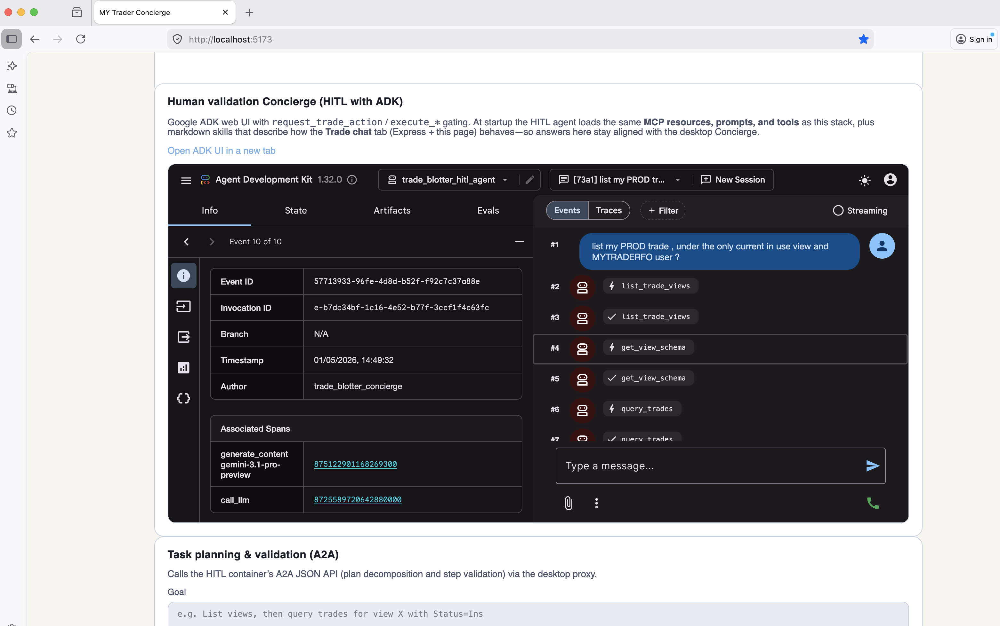
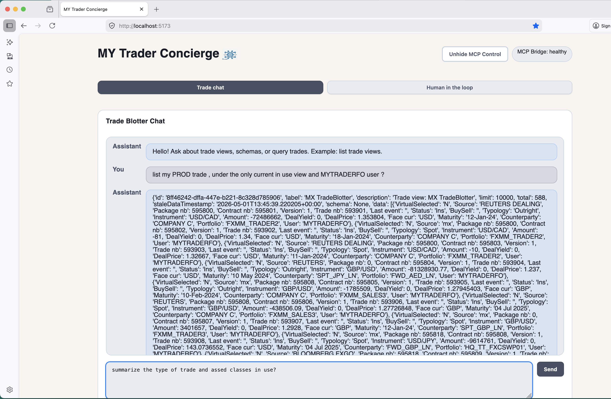
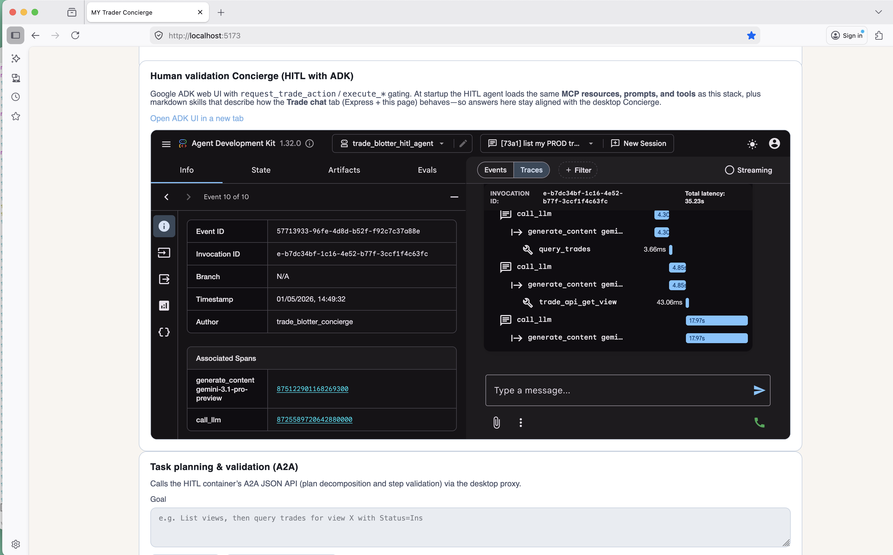
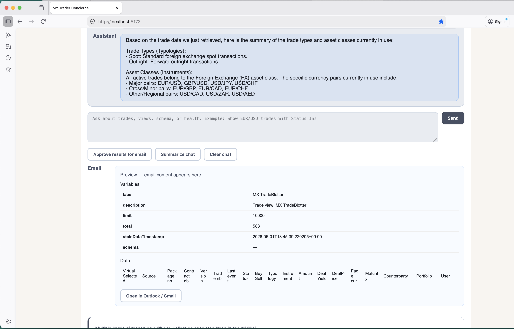
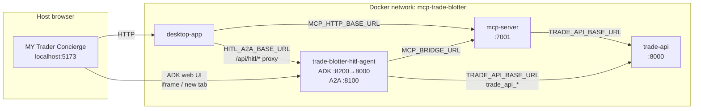

# Trading Concierge MO

## Trading Mid-Office - Multi-Agent Desktop APP
## Built with GEMINI 3.1 -  MCP + API Knowledge transfer + HITL ADK
### Test the Concierge chatbot
### Test the Human-in-the-Loop process(HITL) with explained steps






# Video Demo using MCP

- Our Demo in Video - [Video Demo - MCP Trade Blotter](https://www.youtube.com/watch?v=XEYDrn6GgMw)

# Trade Blotter MCP Applications

This folder runs **four** containers on the shared Docker network **`mcp-trade-blotter`**:

| Service | Role |
|--------|------|
| **`trade-api`** | FastAPI Trade Blotter API (local mock with CSV-backed data, or configurable remote/Murex-backed URL). |
| **`mcp-server`** | MCP HTTP bridge: exposes tools, resources, and prompts; tool implementations call the Trade API. |
| **`desktop-app`** | Node/Express **MY Trader Concierge** UI: Trade chat (Gemini + MCP), MCP discovery, optional approval gate for mutating tools, and a **Human in the loop** tab (ADK iframe + A2A proxy). |
| **`trade-blotter-hitl-agent`** | Google ADK agent with human-in-the-loop gating, direct `trade_api_*` tools, full MCP tool access via the bridge, and an **A2A** HTTP API for planning/classification/validation. |

## Architecture

### Containers and traffic



### How the four services interact

1. **`trade-api`** is the data plane: trade views, health, and trade query endpoints. Nothing else in the stack should bypass it for “official” trade data when using the mock; the HITL agent can also call it **directly** for read-oriented `trade_api_*` tools while still using MCP for richer tool catalogs.

2. **`mcp-server`** is the MCP façade: the desktop **Trade chat** and the **HITL agent** both consume the same bridge (`GET /tools`, `POST /tool/{name}`, resources, prompts). Tool handlers inside MCP translate model-facing operations into REST calls to **`trade-api`**.

3. **`desktop-app`** orchestrates the concierge experience in the browser:
   - Proxies MCP to the UI (`/api/tools`, `/api/tool/:name`, resources, prompts).
   - Runs **Gemini** server-side (`/api/llm/gemini`) with tool-use loops against MCP; **mutating** MCP calls can pause behind an **approval** UI before execution.
   - Embeds or links the ADK web UI using **`HITL_ADK_WEB_PUBLIC_URL`** (default `http://localhost:8200`).
   - Proxies **A2A** JSON calls to the HITL container (`HITL_A2A_BASE_URL`, e.g. `http://trade-blotter-hitl-agent:8100` inside Compose) under routes like `/api/hitl/plan`, `/api/hitl/classify`, `/api/hitl/validate_step`.

4. **`trade-blotter-hitl-agent`** runs **ADK web** (container port 8000, published as **8200** on the host so it does not clash with `trade-api` on 8000) plus **A2A** on **8100**. It loads MCP tools from **`mcp-server`**, may attach **direct Trade API** tools, and applies **HITL** policy (e.g. `tool_classification.yaml`, fail-closed options) so risky operations require human confirmation inside the ADK flow.

### Text-only summary

```
Browser
  → desktop-app (Express)
       → mcp-server:7001  (MCP HTTP)
            → trade-api:8000
       → trade-blotter-hitl-agent:8100  (A2A, via server proxy)
  → trade-blotter-hitl-agent:8200  (ADK web UI, iframe or new tab)

trade-blotter-hitl-agent
  → mcp-server:7001
  → trade-api:8000  (direct REST tools + same backend MCP uses)
```

## Requirements

- Docker and Docker Compose

## Start the stack

From **`tradeBlotterMCPAgent`** (the directory that contains `docker-compose.yml`):

```
export GEMINI_API_KEY=your_api_key
export GOOGLE_API_KEY=your_api_key
export GEMINI_INFERENCE_MODEL=gemini-3.1-pro-preview
export GEMINI_CONTEXT_MODEL=gemini-3.1-pro-preview
export GEMINI_EMBEDDING_MODEL=models/gemini-embedding-001
export GEMINI_TEMPERATURE=1.0
docker compose up --build
```

Optional: override the public ADK URL if you publish HITL on another host/port:

```
export HITL_ADK_WEB_PUBLIC_URL=http://localhost:8200
```

Services will be available at:

- **MY Trader Concierge** (desktop UI): `http://localhost:5173`
- **MCP HTTP bridge**: `http://localhost:7001`
- **Trade API**: `http://localhost:8000`
- **HITL ADK web UI**: `http://localhost:8200` (maps to port 8000 inside the HITL container)
- **HITL A2A API**: `http://localhost:8100` (used by the desktop server proxy, not usually opened directly in the browser)

## Operations

### trade-api

- Health: `GET /health`
- Views: `GET /v1/api/trade-blotter/trade-views`
- View details: `GET /v1/api/trade-blotter/trade-views/{viewId}`

### mcp-server (HTTP bridge)

- Health: `GET /health`
- Tools: `GET /tools`
- Call tool: `POST /tool/{name}` with body `{ "arguments": { ... } }`
- Resources: `GET /resources`
- Read resource: `GET /resource?uri=resource://trade-blotter/api-docs`
- Prompts: `GET /prompts`
- Get prompt: `POST /prompt/{name}` with body `{ "arguments": { ... } }`

### desktop-app (MY Trader Concierge)

Open `http://localhost:5173` and use:

- **Trade chat** — natural language with Gemini; tool calls go to MCP; mutating operations can require **Approve / Reject** in-app.
- **Human in the loop** — full ADK experience (`request_trade_action` / execute gating) aligned with shared policy/skills; **Task planning & validation (A2A)** calls the HITL service through the desktop API.
- **MCP Control** — discovery (list tools, resources, prompts), read resources, call tools from the UI.
- Supporting actions — summarize chat, email preview workflow, health pill for MCP connectivity.

Representative desktop API routes (proxied or implemented in Express): `/api/health`, `/api/tools`, `/api/tool/:name`, `/api/resources`, `/api/resource`, `/api/prompts`, `/api/prompt/:name`, `/api/llm/gemini`, `/api/hitl/plan`, `/api/hitl/classify`, `/api/hitl/validate_step`, `/api/config`.

### trade-blotter-hitl-agent

- **ADK web**: served on container port **8000**, published as **`http://localhost:8200`** in the default Compose file.
- **A2A HTTP**: **`http://localhost:8100`** — planning, tool classification, step validation; CORS allows the desktop origin (`http://localhost:5173` by default).
- **Environment highlights**: `MCP_BRIDGE_URL` → `mcp-server`, `TRADE_API_BASE_URL` → `trade-api`, `TOOL_CLASSIFICATION_PATH`, `A2A_PORT`, Gemini/ADK model settings. See `trade-blotter-hitl-agent/.env.example` and `docker-compose.yml` for the full set.

## LLM (Gemini) usage for the MVP

The MVP is LLM-ready through MCP: the model reads the available tools and
decides which tool calls to make against the MCP HTTP bridge. Gemini is the
recommended LLM for this stack. The **desktop** and **HITL** services can both use Gemini/ADK; keep API keys and model env vars consistent with your deployment.

### Configure Gemini

Set your API key (and optionally a model):

```
export GEMINI_API_KEY=your_api_key
export GEMINI_INFERENCE_MODEL=gemini-3.1-pro-preview
export GEMINI_CONTEXT_MODEL=gemini-3.1-pro-preview
export GEMINI_TEMPERATURE=1.0
```

### How the LLM uses the MVP (Trade chat path)

1. The LLM lists tools from the MCP bridge (via the desktop proxy or directly):
   - `GET http://localhost:7001/tools`
2. It selects a tool based on the user request (e.g., "show trades for EUR/USD").
3. It calls the tool:
   - `POST http://localhost:7001/tool/{name}` with body `{ "arguments": { ... } }`

This keeps the LLM logic separate from the API/desktop UI while still enabling
natural-language trade queries through MCP. The **HITL** agent adds a parallel ADK path with stricter human oversight and A2A orchestration.

## Stop the stack

```
docker compose down
```
